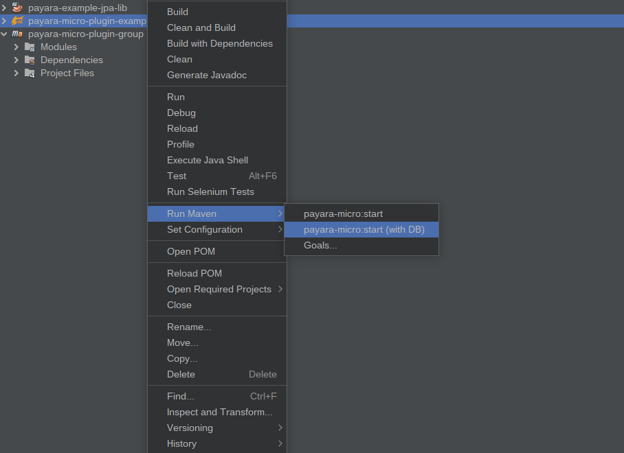

# payara-micro-plugin-group

Launch the web project `payara-micro-plugin-example` using Netbeans (see contents of `nbactions.xml` to change the database values) by right-clicking on the web project and selecting `Run Maven` -> `payara-micro:start (with DB)`:



Alternatively, use the terminal, changing the values as required:

```shell
DATABASE_USER=user DATABASE_PASS=password DATABASE_NAME=MY_DB_NAME DATABASE_SERVER=localhost DATABASE_SERVER_PORT=1234 JAVA_HOME=/usr/lib/jvm/java-1.8.0-openjdk-amd64 M2_HOME=/usr/share/maven /usr/share/maven/bin/mvn payara-micro:start
```

The database connection is created via `payara-micro-plugin-example/src/main/webapp/WEB-INF/payara-resources.xml`, where the connection details are plucked from environment variables passed on the commandline.

```xml
<?xml version="1.0" encoding="UTF-8"?>
<!DOCTYPE resources PUBLIC "-//Payara.fish//DTD Payara Server 4 Resource Definitions//EN" "https://raw.githubusercontent.com/payara/Payara-Server-Documentation/master/schemas/payara-resources_1_6.dtd">
<resources>
    <jdbc-resource pool-name="ServicesDB" jndi-name="java:app/jdbc/services-myapp" enabled="true" ></jdbc-resource>

    <jdbc-connection-pool datasource-classname="com.microsoft.sqlserver.jdbc.SQLServerDataSource"     
                          name="ServicesDB" 
                          res-type="javax.sql.DataSource"
                          is-connection-validation-required="true"
                          connection-validation-method="table"
                          validation-table-name="sys.tables"
                          fail-all-connections="true">
        <property name="User" value="${ENV=DATABASE_USER}"></property>
        <property name="Password" value="${ENV=DATABASE_PASS}"></property>
        <property name="DatabaseName" value="${ENV=DATABASE_NAME}"></property>
        <property name="ServerName" value="${ENV=DATABASE_SERVER}"></property>
        <property name="PortNumber" value="${ENV=DATABASE_SERVER_PORT}"></property>
    </jdbc-connection-pool>  
</resources>

```

# Plugin configuration

Note that the location of both `pre-boot-commands.txt` and `post-boot-commands.txt` are located in `${project.basedir}/src/main/resources/`.  

You can add all payara-micro cli commands under `<commandLineOptions>`.

```xml

            <plugin>
                <groupId>fish.payara.maven.plugins</groupId>
                <artifactId>payara-micro-maven-plugin</artifactId>
                <version>1.4.0</version>
                <configuration>
                    <useUberJar>false</useUberJar>
                    <contextRoot>/myapp</contextRoot>
                    <payaraVersion>${version.payara}</payaraVersion>
                    <deployWar>false</deployWar>
                    <artifactItem>
                        <groupId>fish.payara.extras</groupId>
                        <artifactId>payara-micro</artifactId>
                        <version>${version.payara.micro}</version>
                    </artifactItem>
                    <javaCommandLineOptions>
                        <option>
                            <value>-Xdebug</value>
                        </option>
                    </javaCommandLineOptions>
                    <commandLineOptions>
                        <option>
                            <key>--autoBindHttp</key>
                        </option>
                        <option>
                            <key>--nocluster</key>
                        </option>
                        <option>
                            <key>--port</key>
                            <value>8095</value>
                        </option>
                        <option>
                            <key>--prebootcommandfile</key>
                            <value>${project.basedir}/src/main/resources/pre-boot-commands.txt</value>
                        </option>
                        <option>
                            <key>--postbootcommandfile</key>
                            <value>${project.basedir}/src/main/resources/post-boot-commands.txt</value>
                        </option>
                        <option>
                            <key>--deploy</key>
                            <value>${project.build.directory}/${project.build.finalName}</value>
                        </option>
                    </commandLineOptions>
                </configuration>
            </plugin>
```